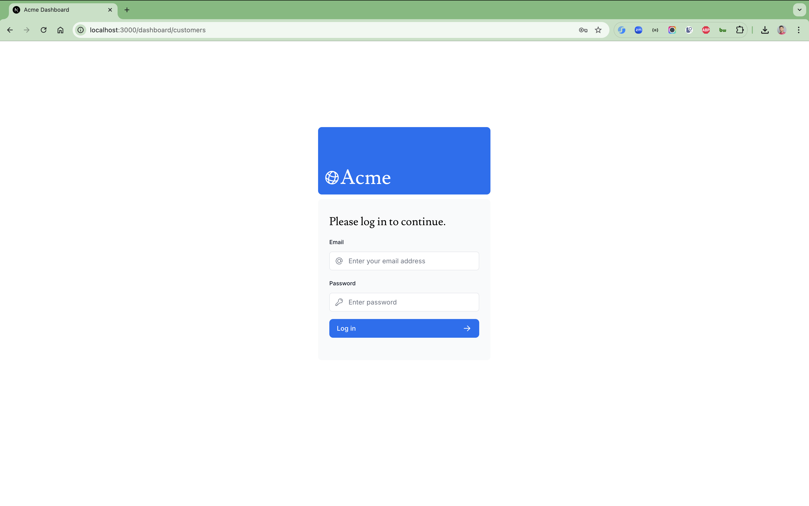
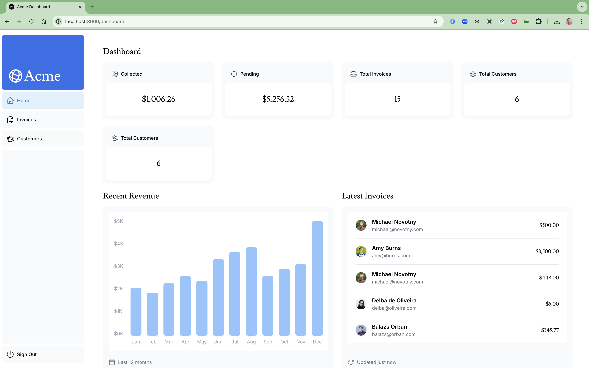
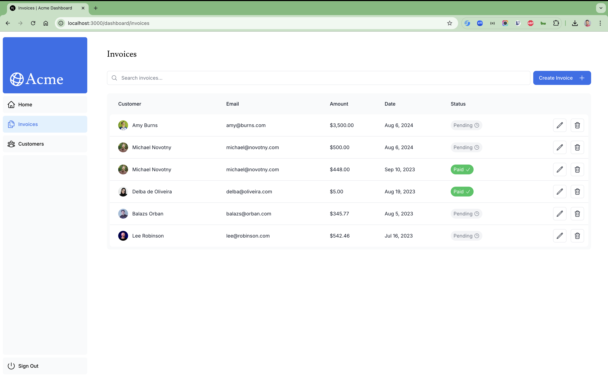
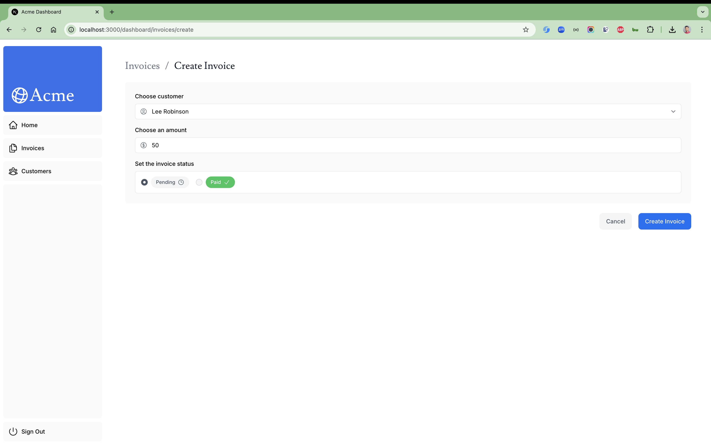
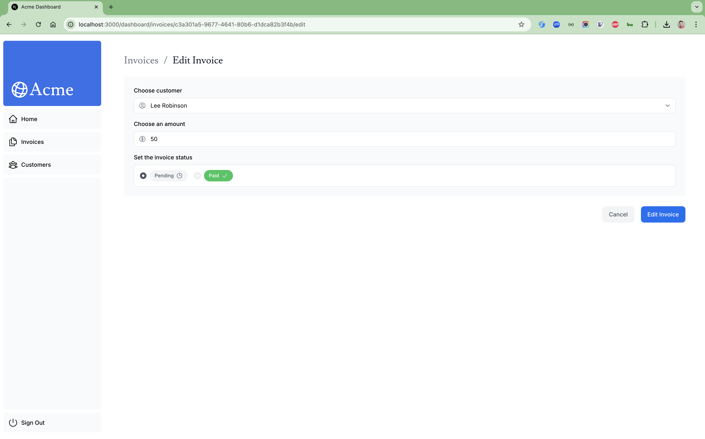

## Next.js App Router Course - Starter

### Things todo list

1. Clone this repository: `git clone https://github.com/hendisantika/nextjs14-dashboard.git`
2. Navigate to the folder: `cd nextjs14-dashboard`
3. Run the command: `cp .env.example .env` then set your credentials
4. Run the command: `pnpm install`
5. Run the command: `pnpm dev`
6. Open your favorite browser: http://localhost:3000

7. This is the starter template for the Next.js App Router Course. It contains the starting code for the dashboard
   application.

```shell
openssl rand -base64 32
```

For more information, see the [course curriculum](https://nextjs.org/learn) on the Next.js Website.

### Image Screen shot

Login page



Dashboard Page



List Invoices



Add New Invoice



Edit Invoice


